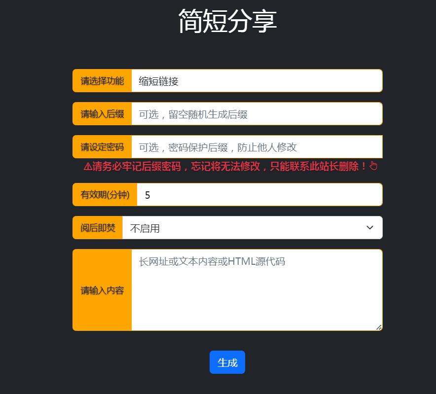

# short-url 缩短链接

### 部署:

在serv00.net创建一个帐号，将`template.html` `index.php` `.htaccess` 三个文件
上传到`/usr/home/你的帐号/domains/你的帐号.serv00.net/public_html/*`里面 
打开浏览器打开`你的帐号.serv00.net/short` 即可   （注意： 其中`mysql.php`是使用mysql数据库保存的 和 `index.php` 二选一即可，如果使用mysql保存 需要编辑里面的改为你的数据库帐号密码 并将`mysql.php`更名为`index.php`）

### 忘记密码:

在`/usr/home/你的帐号/domains/你的帐号.serv00.net/public_html/shortlinks/后缀名.json`里面的`"password":"abc"`  其中的abc就是密码，改成`"password":""`或者直接删除这个`后缀名.json`即可重置密码
